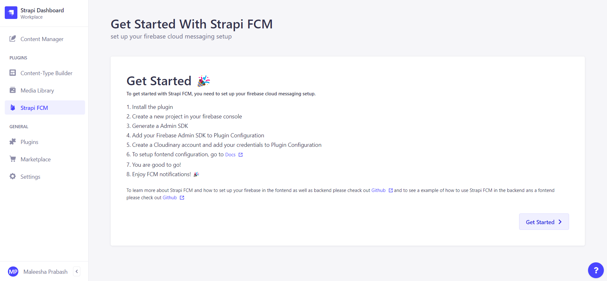
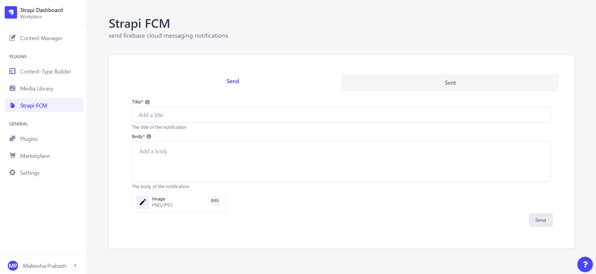

## Strapi FCM

> Send push cloud notifications to your userbase


### Installation

> npm: `npm install `

```bash
$ npm install --save strapi-fcm
```

> yarn: `yarn add `

```bash
$ yarn add strapi-fcm
```

### Demo Video Playlist

[Demo Video Playlist](https://www.youtube.com/playlist?list=PL32dHJaVH1H6VxBL3iFLA4be9rgVzIO7n)

### Steps

1. Create a new project

`Create a new project and add strapi-fcm to your project.`

2. Add the plugin to your project

`To get started, read the getting started guide. then for a example project click on dimo links for some important documentations click docs links.`

 3. Configure API keys and Admin SDK at `/settings/strapi-fcm`

`To configure Cloudinary API keys and Admin SDK, go to the settings page and click on the Strapi FCM tab. there will be links for firebase docs and cloudinary docs. You can follow those guidelines to configure your keys.`

 4. Send notification tokens to backend from the fontend using the `/strapi-fcm/users/tokens` endpoint

`To configure the font-end use this snippit or use your own snippit for saving fcm tokens to back-end database please use the following api endpoint https://server/strapi-fcm/users/tokens. To get notification tokens must be sent to back-end.`

```javascript
useEffect(() => {
  try {
    getToken(messaging)
      .then(async (token) => {
        if (token) {
          axios
            .post(`${SERVER}/strapi-fcm/users/tokens`, {
              token: token,
            })
            .then((res) => {
              // Handle success
            });
        } else {
          Push.Permission.request(
            () => {
              // User has granted permission
            },
            () => {
              // User has denied permission
            }
          );
        }
      })
      .catch(() => {});
  } catch (error) {
    // Handle error
  }
}, []);
```

5. Go to `/admin/plugins/strapi-fcm`

`You can see the full dashboard for the plugin. There are two tabs such as Send and Sent. `

6. Send a notification to your userbase

`To send a cloud notification to userbase, go and fill the title field and body field image is not compulsory but if you want to send an image then you can upload it. Then click on send button.`



7. See previous notifications in your userbase by clicking on the `sent` tab

`To see your previous notifications, click on the sent tab. Then you can see the notifications sent to your userbase. `


8. Enjoy your cloud notifications

`You can enjoy your cloud notifications by testing it in the browser.`


9. Send a notification from your blog post

`You also can send a notification from your blog post. Its on your blog post page. You can selectet which field you want to send as the title and body. Its easy to send a notification from your blog post.`


10. Update your credentials at `/settings/strapi-fcm`

`To update your credentials, go to the settings page and click on the Strapi FCM tab. You can update your credentials here.`


