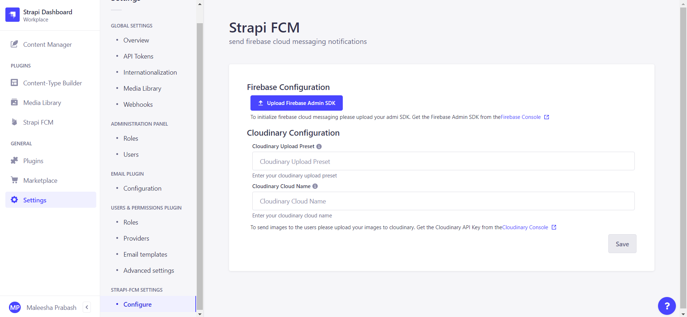
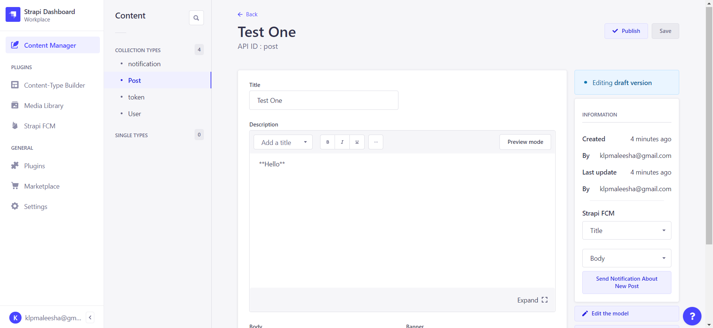

## Strapi FCM

> Send push cloud notifications to your userbase


### Installation

> npm: `npm install `

```bash
$ npm install --save strapi-fcm
```

> yarn: `yarn add `

```bash
$ yarn add strapi-fcm
```

### Demo Video

`V 0.0.1` [How to use strapi FCM video Version 0.0.1](https://youtu.be/jrvwf9iUamk)

`V 0.0.5` [How to use strapi FCM video Version 0.0.4](https://youtu.be/jrvwf9iUamk)

### Steps

1. Create a new project
2. Add the plugin to your project
   
3. Configure API keys and Admin SDK at `/settings/strapi-fcm`
   
4. Send notification tokens to backend from the fontend using the `/strapi-fcm/users/tokens` endpoint

```javascript
useEffect(() => {
  try {
    getToken(messaging)
      .then(async (token) => {
        if (token) {
          axios
            .post(`${SERVER}/strapi-fcm/users/tokens`, {
              token: token,
            })
            .then((res) => {
              // Handle success
            });
        } else {
          Push.Permission.request(
            () => {
              // User has granted permission
            },
            () => {
              // User has denied permission
            }
          );
        }
      })
      .catch(() => {});
  } catch (error) {
    // Handle error
  }
}, []);
```

5. Go to `/admin/plugins/strapi-fcm`
6. Send a notification to your userbase
   
7. See previous notifications in your userbase by clicking on the `sent` tab
   
8. Enjoy your cloud notifications
   
9. Send a notification from your blog post
   
10. Update your credentials at `/settings/strapi-fcm`
    
